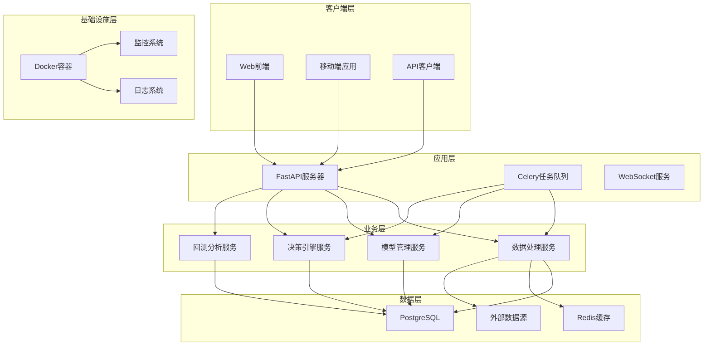

# 股票回测决策系统 - 系统架构总览

## 1. 系统概述

### 1.1 项目背景

股票回测决策系统是一个基于多模型投票机制的自动化交易决策平台。系统通过运行多个回测模型，根据投票结果生成每日买卖点决策，为投资者提供数据驱动的交易建议。

### 1.2 核心功能

- **多模型协同决策**：集成多种技术指标和机器学习模型
- **智能投票机制**：基于权重和置信度的决策聚合
- **实时数据处理**：支持实时行情和历史数据的处理
- **风险控制**：集成波动率检测和仓位管理
- **可视化分析**：提供决策结果和性能指标的可视化展示

### 1.3 设计原则

- **模块化设计**：各组件松耦合，易于扩展和维护
- **高可用性**：支持容器化部署和水平扩展
- **数据一致性**：确保决策过程的透明性和可追溯性
- **性能优化**：支持高并发数据处理和实时决策

## 2. 整体架构

### 2.1 架构图



### 2.2 技术栈选择

#### 后端技术栈

- **Web 框架**: FastAPI (高性能，异步支持)
- **任务队列**: Celery + Redis
- **数据库**: PostgreSQL (关系型数据) + Redis (缓存)
- **ORM**: SQLAlchemy (异步支持)
- **数据处理**: Pandas, NumPy, TA-Lib
- **机器学习**: scikit-learn, XGBoost (可选)

#### 前端技术栈

- **框架**: Vue.js 3 + TypeScript
- **UI 库**: Element Plus
- **状态管理**: Pinia
- **路由**: Vue Router
- **图表**: ECharts

#### 部署和运维

- **容器化**: Docker + Docker Compose
- **监控**: Prometheus + Grafana
- **日志**: 结构化日志 + ELK Stack
- **CI/CD**: GitHub Actions

## 3. 核心组件设计

### 3.1 数据处理管道

```python
# 数据处理流程
数据采集 → 数据清洗 → 特征工程 → 模型输入
```

**关键特性**:

- 支持批量处理和实时流处理
- 自动化的数据质量检查
- 可配置的特征工程管道
- 数据版本控制和回溯

### 3.2 模型管理框架

```python
# 模型生命周期
模型注册 → 参数验证 → 性能评估 → 决策生成
```

**关键特性**:

- 插件化的模型架构
- 统一的模型接口
- 自动化的性能监控
- 动态的权重调整

### 3.3 决策引擎

```python
# 决策流程
模型投票 → 权重计算 → 阈值检查 → 风险控制 → 最终决策
```

**关键特性**:

- 多种投票策略支持
- 实时风险监控
- 决策结果的可解释性
- 历史决策的回溯分析

## 4. 数据流设计

### 4.1 实时数据流

```
外部数据源 → 数据采集服务 → 实时特征计算 → 模型推理 → 决策生成 → 前端展示
```

### 4.2 批量处理流

```
历史数据 → 批量特征工程 → 模型训练 → 性能评估 → 决策回测 → 报告生成
```

### 4.3 任务调度流

```
定时触发器 → Celery任务队列 → 分布式处理 → 结果存储 → 状态更新
```

## 5. 系统特性

### 5.1 性能特性

- **高并发处理**: 支持数百只股票的并行决策
- **低延迟响应**: API 响应时间 < 100ms
- **高可用性**: 99.9%的系统可用性
- **可扩展性**: 支持水平扩展和负载均衡

### 5.2 安全特性

- **数据加密**: 敏感数据的加密存储
- **访问控制**: 基于角色的权限管理
- **审计日志**: 完整的操作日志记录
- **输入验证**: 严格的数据验证和清洗

### 5.3 监控特性

- **实时监控**: 系统性能和业务指标监控
- **告警机制**: 多级别的异常告警
- **日志分析**: 结构化的日志记录和分析
- **性能追踪**: 端到端的性能追踪

## 6. 部署架构

### 6.1 开发环境

- 单机 Docker 部署
- 本地数据库和缓存
- 开发工具集成

### 6.2 测试环境

- 容器化部署
- 测试数据隔离
- 自动化测试流水线

### 6.3 生产环境

- 多节点集群部署
- 负载均衡和故障转移
- 监控和告警系统

## 7. 扩展性设计

### 7.1 水平扩展

- 无状态的服务设计
- 数据库读写分离
- 缓存集群支持

### 7.2 功能扩展

- 插件化的模型架构
- 可配置的决策规则
- 模块化的功能组件

### 7.3 数据扩展

- 分库分表支持
- 时序数据优化
- 大数据处理集成

## 8. 风险评估

### 8.1 技术风险

- 第三方数据源稳定性
- 模型过拟合风险
- 系统性能瓶颈

### 8.2 业务风险

- 决策准确性波动
- 市场异常情况处理
- 监管合规要求

### 8.3 应对策略

- 多数据源备份
- 模型多样性设计
- 严格的风险控制
- 完整的审计追踪

---

**文档版本**: v1.0  
**最后更新**: 2025-10-16  
**维护者**: 架构设计团队
