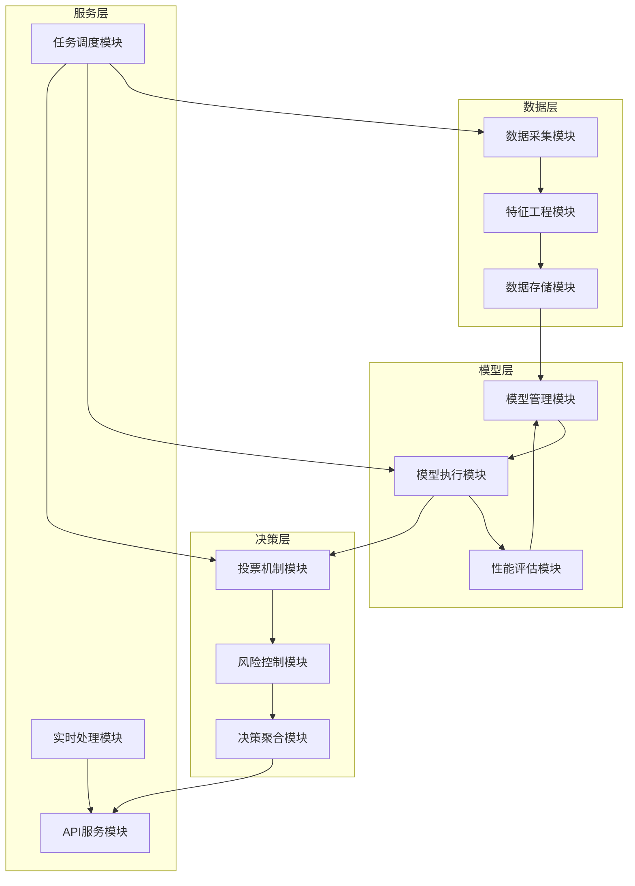

# 股票回测决策系统 - 核心模块设计

## 1. 模块架构总览

### 1.1 模块分层架构



## 2. 数据处理模块

### 2.1 数据采集模块

**设计目标**: 统一的数据采集接口，支持多数据源

```python
class DataCollector:
    """数据采集器基类"""

    def __init__(self, config: DataSourceConfig):
        self.config = config
        self.cache = RedisCache()

    async def fetch_real_time_data(self, symbols: List[str]) -> pd.DataFrame:
        """获取实时数据"""
        pass

    async def fetch_historical_data(self, symbol: str,
                                  start_date: str, end_date: str) -> pd.DataFrame:
        """获取历史数据"""
        pass

    async def update_daily_data(self, symbol: str) -> bool:
        """更新每日数据"""
        pass
```

**关键特性**:

- 支持数据源故障转移
- 数据缓存机制
- 请求频率限制
- 数据质量检查

### 2.2 特征工程模块

**设计目标**: 统一的特征计算框架，支持自定义特征

```python
class BaseFeatureEngineer(ABC):
    """特征工程基类"""

    def __init__(self, data: pd.DataFrame):
        self.data = data
        self.features = {}

    @abstractmethod
    def calculate_features(self) -> pd.DataFrame:
        """计算所有特征"""
        pass

    def add_technical_indicators(self) -> None:
        """添加技术指标"""
        # SMA, EMA, RSI, MACD, Bollinger Bands等

    def add_statistical_features(self) -> None:
        """添加统计特征"""
        # 价格变化率、波动率、动量等

    def add_time_series_features(self) -> None:
        """添加时间序列特征"""
        # 滞后特征、滚动窗口特征等
```

**特征类型**:

- **技术指标**: 移动平均线、RSI、MACD 等
- **统计特征**: 均值、方差、偏度、峰度等
- **时间特征**: 季节性、趋势、周期性等
- **量价特征**: 成交量相关指标

## 3. 模型管理模块

### 3.1 模型基类设计

```python
class BaseBacktestModel(ABC):
    """回测模型基类"""

    def __init__(self, model_id: int, name: str, description: str = ""):
        self.model_id = model_id
        self.name = name
        self.description = description
        self.parameters = {}
        self.is_trained = False
        self.performance_metrics = {}

    @abstractmethod
    def generate_signal(self, data: pd.DataFrame) -> ModelSignal:
        """生成交易信号"""
        pass

    @abstractmethod
    def validate_parameters(self) -> bool:
        """验证模型参数"""
        pass

    def backtest(self, data: pd.DataFrame, initial_capital: float = 100000) -> Dict:
        """执行回测"""
        pass
```

### 3.2 模型信号类

```python
class ModelSignal:
    """模型信号类"""

    def __init__(self, decision: DecisionType, confidence: float,
                 signal_strength: float, reasoning: Optional[str] = None):
        self.decision = decision
        self.confidence = confidence
        self.signal_strength = signal_strength
        self.reasoning = reasoning

    def to_dict(self) -> Dict[str, Any]:
        return {
            "decision": self.decision.value,
            "confidence": self.confidence,
            "signal_strength": self.signal_strength,
            "reasoning": self.reasoning
        }
```

### 3.3 具体模型实现

#### 3.3.1 移动平均线交叉模型

```python
class MovingAverageCrossover(BaseBacktestModel):
    """移动平均线交叉模型"""

    def __init__(self, model_id: int, short_window: int = 5, long_window: int = 20):
        super().__init__(model_id, "移动平均线交叉模型")
        self.short_window = short_window
        self.long_window = long_window

    def generate_signal(self, data: pd.DataFrame) -> ModelSignal:
        # 计算移动平均线
        sma_short = talib.SMA(data['close'], timeperiod=self.short_window)
        sma_long = talib.SMA(data['close'], timeperiod=self.long_window)

        # 生成交叉信号
        if sma_short.iloc[-1] > sma_long.iloc[-1] and sma_short.iloc[-2] <= sma_long.iloc[-2]:
            return ModelSignal(DecisionType.BUY, 0.7, 0.8, "金叉信号")
        elif sma_short.iloc[-1] < sma_long.iloc[-1] and sma_short.iloc[-2] >= sma_long.iloc[-2]:
            return ModelSignal(DecisionType.SELL, 0.7, 0.8, "死叉信号")
        else:
            return ModelSignal(DecisionType.HOLD, 0.5, 0.3, "无交叉信号")
```

#### 3.3.2 RSI 模型

```python
class RSIModel(BaseBacktestModel):
    """RSI模型"""

    def __init__(self, model_id: int, period: int = 14,
                 overbought: int = 70, oversold: int = 30):
        super().__init__(model_id, "RSI模型")
        self.period = period
        self.overbought = overbought
        self.oversold = oversold

    def generate_signal(self, data: pd.DataFrame) -> ModelSignal:
        rsi = talib.RSI(data['close'], timeperiod=self.period)
        current_rsi = rsi.iloc[-1]

        if current_rsi < self.oversold:
            return ModelSignal(DecisionType.BUY, 0.8, 0.9, "RSI超卖")
        elif current_rsi > self.overbought:
            return ModelSignal(DecisionType.SELL, 0.8, 0.9, "RSI超买")
        else:
            return ModelSignal(DecisionType.HOLD, 0.6, 0.5, "RSI正常区间")
```

### 3.4 模型管理器

```python
class ModelManager:
    """模型管理器"""

    def __init__(self):
        self.models: Dict[int, BaseBacktestModel] = {}
        self.model_registry = self._initialize_model_registry()

    def _initialize_model_registry(self) -> Dict[str, Any]:
        return {
            'moving_average_crossover': MovingAverageCrossover,
            'rsi_model': RSIModel,
            'macd_model': MACDModel
        }

    def register_model(self, model_id: int, model_type: str, **kwargs) -> BaseBacktestModel:
        """注册新模型"""
        model_class = self.model_registry[model_type]
        model = model_class(model_id, **kwargs)

        if not model.validate_parameters():
            raise ValueError("模型参数验证失败")

        self.models[model_id] = model
        return model

    def run_models_on_data(self, data: pd.DataFrame) -> Dict[int, Any]:
        """在所有模型上运行数据"""
        results = {}
        for model_id, model in self.models.items():
            try:
                signal = model.generate_signal(data)
                results[model_id] = {
                    'model_name': model.name,
                    'signal': signal.to_dict()
                }
            except Exception as e:
                results[model_id] = {'error': str(e)}
        return results
```

## 4. 决策引擎模块

### 4.1 投票配置

```python
@dataclass
class VotingConfig:
    """投票配置"""
    strategy: VotingStrategy = VotingStrategy.WEIGHTED
    threshold: float = 0.6  # 决策阈值
    min_confidence: float = 0.6  # 最小置信度
    enable_risk_control: bool = True
```

### 4.2 决策引擎核心

```python
class DecisionEngine:
    """决策引擎"""

    def __init__(self, config: Optional[VotingConfig] = None):
        self.config = config or VotingConfig()
        self.model_weights: Dict[int, float] = {}

    def aggregate_decisions(self, model_decisions: Dict[int, ModelSignal]) -> FinalDecision:
        """聚合多个模型的决策"""
        if not model_decisions:
            return self._create_hold_decision("无模型决策")

        # 统计投票
        vote_counts = self._count_votes(model_decisions)

        # 根据策略计算最终决策
        if self.config.strategy == VotingStrategy.MAJORITY:
            return self._majority_voting(model_decisions, vote_counts)
        elif self.config.strategy == VotingStrategy.WEIGHTED:
            return self._weighted_voting(model_decisions, vote_counts)
        else:
            return self._confidence_weighted_voting(model_decisions, vote_counts)
```

### 4.3 投票策略实现

#### 4.3.1 简单多数投票

```python
def _majority_voting(self, model_decisions: Dict[int, ModelSignal],
                    vote_counts: Dict[DecisionType, int]) -> FinalDecision:
    """简单多数投票"""
    total_votes = sum(vote_counts.values())
    max_votes = 0
    winning_decision = DecisionType.HOLD

    for decision_type, count in vote_counts.items():
        if count > max_votes:
            max_votes = count
            winning_decision = decision_type

    vote_ratio = max_votes / total_votes

    if vote_ratio >= self.config.threshold:
        confidence = self._calculate_confidence(model_decisions, winning_decision)
        if confidence >= self.config.min_confidence:
            return FinalDecision(
                decision=winning_decision,
                confidence=confidence,
                vote_summary=vote_counts,
                reasoning=f"多数投票通过: {vote_ratio:.1%}"
            )

    return self._create_hold_decision(f"投票未达阈值: {vote_ratio:.1%}")
```

#### 4.3.2 加权投票

```python
def _weighted_voting(self, model_decisions: Dict[int, ModelSignal],
                    vote_counts: Dict[DecisionType, int]) -> FinalDecision:
    """加权投票"""
    weighted_scores = {decision_type: 0.0 for decision_type in DecisionType}

    for model_id, signal in model_decisions.items():
        if signal and signal.decision:
            weight = self.model_weights.get(model_id, 0.0)
            weighted_scores[signal.decision] += weight

    max_score = 0.0
    winning_decision = DecisionType.HOLD

    for decision_type, score in weighted_scores.items():
        if score > max_score:
            max_score = score
            winning_decision = decision_type

    if max_score >= self.config.threshold:
        confidence = self._calculate_weighted_confidence(model_decisions, winning_decision)
        if confidence >= self.config.min_confidence:
            return FinalDecision(
                decision=winning_decision,
                confidence=confidence,
                vote_summary=vote_counts,
                reasoning=f"加权投票通过: {max_score:.1%}"
            )

    return self._create_hold_decision(f"加权投票未达阈值: {max_score:.1%}")
```

## 5. 风险控制模块

### 5.1 风险配置

```python
@dataclass
class RiskConfig:
    """风险配置"""
    max_daily_loss: float = 0.05  # 最大日亏损
    max_position_size: float = 0.1  # 最大仓位比例
    volatility_threshold: float = 0.03  # 波动率阈值
    enable_circuit_breaker: bool = True  # 启用熔断机制
```

### 5.2 风险控制器

```python
class RiskController:
    """风险控制器"""

    def __init__(self, config: Optional[RiskConfig] = None):
        self.config = config or RiskConfig()
        self.daily_pnl = 0.0
        self.current_positions: Dict[str, float] = {}

    def assess_decision_risk(self, decision: FinalDecision,
                           stock_data: Dict[str, Any],
                           current_position: Optional[float] = None) -> Dict[str, Any]:
        """评估决策风险"""
        risk_assessment = {
            'is_approved': True,
            'risk_level': decision.risk_level,
            'warnings': [],
            'adjusted_decision': decision.decision,
            'position_suggestion': 1.0
        }

        # 检查波动率风险
        if self._check_volatility_risk(stock_data):
            risk_assessment['warnings'].append("高波动率风险")
            risk_assessment['position_suggestion'] *= 0.5

        # 检查仓位风险
        if current_position and current_position > self.config.max_position_size:
            risk_assessment['warnings'].append("超过最大仓位限制")
            risk_assessment['is_approved'] = False

        return risk_assessment
```

## 6. 任务调度模块

### 6.1 Celery 配置

```python
# Celery应用配置
celery_app = Celery(
    'stock_trading',
    broker='redis://localhost:6380/0',
    backend='redis://localhost:6380/0'
)

# 定时任务配置
celery_app.conf.beat_schedule = {
    'update-daily-stock-data': {
        'task': 'data_tasks.update_all_stocks_data',
        'schedule': crontab(hour=18, minute=0),
    },
    'generate-daily-decisions': {
        'task': 'decision_tasks.generate_daily_decisions',
        'schedule': crontab(hour=9, minute=30),
    }
}
```

### 6.2 数据处理任务

```python
@shared_task
def update_all_stocks_data():
    """更新所有股票数据"""
    try:
        loop = asyncio.get_event_loop()
        result = loop.run_until_complete(_update_all_stocks_data())
        return result
    except Exception as e:
        return {'status': 'error', 'error': str(e)}

async def _update_all_stocks_data() -> Dict[str, Any]:
    """异步更新所有股票数据"""
    stock_service = StockService()
    stocks = await stock_service.get_stocks(active_only=True)

    updated_count = 0
    for stock in stocks:
        success = await stock_service.update_stock_data(stock.symbol)
        if success:
            updated_count += 1
        await asyncio.sleep(0.1)  # 避免请求过于频繁

    return {'updated_count': updated_count}
```

## 7. 模块间交互

### 7.1 数据流交互

```
数据采集 → 特征工程 → 模型输入 → 模型执行 → 决策聚合 → 风险控制 → 最终决策
```

### 7.2 服务依赖

```python
class DecisionEngineManager:
    """决策引擎管理器"""

    def __init__(self, model_manager: ModelManager,
                 voting_config: Optional[VotingConfig] = None,
                 risk_config: Optional[RiskConfig] = None):
        self.model_manager = model_manager
        self.decision_engine = DecisionEngine(voting_config)
        self.risk_controller = RiskController(risk_config)
```

### 7.3 错误处理策略

- **数据层错误**: 重试机制 + 数据源切换
- **模型层错误**: 模型隔离 + 性能降级
- **决策层错误**: 默认观望决策 + 告警通知
- **服务层错误**: 熔断机制 + 服务降级

## 8. 性能优化

### 8.1 缓存策略

- **数据缓存**: Redis 缓存热点数据
- **模型缓存**: 预加载常用模型
- **结果缓存**: 缓存决策结果

### 8.2 并发处理

- **异步 IO**: 使用 async/await 提高并发性能
- **线程池**: CPU 密集型任务使用线程池
- **进程池**: 模型训练使用多进程

### 8.3 内存管理

- **数据分块**: 大数据集分块处理
- **垃圾回收**: 及时释放不再使用的对象
- **内存监控**: 实时监控内存使用情况

---

**文档版本**: v1.0  
**最后更新**: 2025-10-16  
**维护者**: 核心开发团队
