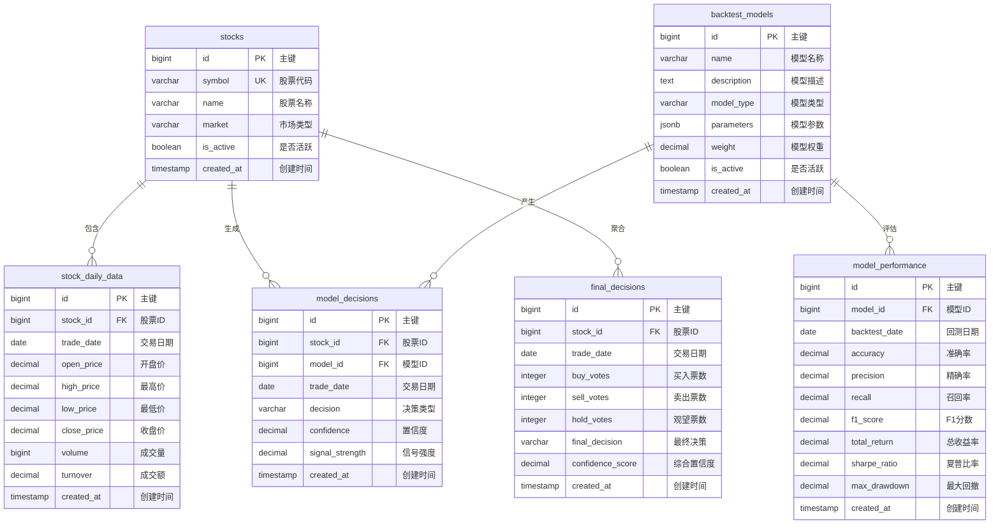

# 股票回测决策系统 - 数据模型设计

## 1. 数据库架构总览

### 1.1 设计原则

- **规范化设计**: 遵循数据库设计第三范式
- **性能优化**: 针对时序数据和查询模式优化
- **扩展性**: 支持水平扩展和分库分表
- **一致性**: 确保数据完整性和业务逻辑一致性

### 1.2 数据库选型

- **主数据库**: PostgreSQL 13+
  - 强大的关系型数据支持
  - JSONB 字段支持灵活的数据结构
  - 时序数据扩展支持
- **缓存数据库**: Redis 6+
  - 高性能缓存和会话存储
  - 消息队列支持
  - 实时数据缓存

## 2. 核心数据表设计

### 2.1 实体关系图



## 3. 详细表结构

### 3.1 股票基本信息表 (stocks)

```sql
CREATE TABLE stocks (
    id BIGSERIAL PRIMARY KEY,
    symbol VARCHAR(20) UNIQUE NOT NULL,
    name VARCHAR(100) NOT NULL,
    market VARCHAR(10) NOT NULL,
    is_active BOOLEAN DEFAULT TRUE,
    created_at TIMESTAMP DEFAULT NOW()
);

-- 索引设计
CREATE INDEX idx_stocks_symbol ON stocks(symbol);
CREATE INDEX idx_stocks_market ON stocks(market);
CREATE INDEX idx_stocks_active ON stocks(is_active);
```

**字段说明**:

- `symbol`: 股票代码，唯一标识
- `market`: 市场类型 (SH/SZ/HK 等)
- `is_active`: 是否活跃，用于软删除

### 3.2 股票日线数据表 (stock_daily_data)

```sql
CREATE TABLE stock_daily_data (
    id BIGSERIAL PRIMARY KEY,
    stock_id BIGINT NOT NULL REFERENCES stocks(id) ON DELETE CASCADE,
    trade_date DATE NOT NULL,
    open_price DECIMAL(10,4),
    high_price DECIMAL(10,4),
    low_price DECIMAL(10,4),
    close_price DECIMAL(10,4),
    volume BIGINT,
    turnover DECIMAL(15,2),
    created_at TIMESTAMP DEFAULT NOW(),

    -- 复合唯一约束
    UNIQUE(stock_id, trade_date)
);

-- 索引设计
CREATE INDEX idx_daily_data_stock_date ON stock_daily_data(stock_id, trade_date DESC);
CREATE INDEX idx_daily_data_date ON stock_daily_data(trade_date);
CREATE INDEX idx_daily_data_stock ON stock_daily_data(stock_id);
```

**字段说明**:

- 存储股票每日交易数据
- 复合唯一约束防止重复数据
- 时序数据优化索引设计

### 3.3 回测模型表 (backtest_models)

```sql
CREATE TABLE backtest_models (
    id BIGSERIAL PRIMARY KEY,
    name VARCHAR(100) NOT NULL,
    description TEXT,
    model_type VARCHAR(50),
    parameters JSONB,
    weight DECIMAL(3,2) DEFAULT 1.0,
    is_active BOOLEAN DEFAULT TRUE,
    created_at TIMESTAMP DEFAULT NOW()
);

-- 索引设计
CREATE INDEX idx_models_type ON backtest_models(model_type);
CREATE INDEX idx_models_active ON backtest_models(is_active);
CREATE INDEX idx_models_parameters ON backtest_models USING GIN(parameters);
```

**字段说明**:

- `model_type`: 模型类型 (technical/ml/dl)
- `parameters`: JSONB 格式存储模型参数
- `weight`: 模型在投票中的权重

### 3.4 模型决策记录表 (model_decisions)

```sql
CREATE TABLE model_decisions (
    id BIGSERIAL PRIMARY KEY,
    stock_id BIGINT NOT NULL REFERENCES stocks(id) ON DELETE CASCADE,
    model_id BIGINT NOT NULL REFERENCES backtest_models(id) ON DELETE CASCADE,
    trade_date DATE NOT NULL,
    decision VARCHAR(10) NOT NULL CHECK (decision IN ('BUY', 'SELL', 'HOLD')),
    confidence DECIMAL(5,4) CHECK (confidence >= 0 AND confidence <= 1),
    signal_strength DECIMAL(5,4) CHECK (signal_strength >= 0 AND signal_strength <= 1),
    created_at TIMESTAMP DEFAULT NOW(),

    -- 复合唯一约束
    UNIQUE(stock_id, model_id, trade_date)
);

-- 索引设计
CREATE INDEX idx_model_decisions_stock_date ON model_decisions(stock_id, trade_date DESC);
CREATE INDEX idx_model_decisions_model_date ON model_decisions(model_id, trade_date DESC);
CREATE INDEX idx_model_decisions_decision ON model_decisions(decision);
```

**字段说明**:

- 记录每个模型对每只股票的每日决策
- 包含置信度和信号强度指标
- 支持决策回溯和分析

### 3.5 综合决策表 (final_decisions)

```sql
CREATE TABLE final_decisions (
    id BIGSERIAL PRIMARY KEY,
    stock_id BIGINT NOT NULL REFERENCES stocks(id) ON DELETE CASCADE,
    trade_date DATE NOT NULL,
    buy_votes INTEGER DEFAULT 0,
    sell_votes INTEGER DEFAULT 0,
    hold_votes INTEGER DEFAULT 0,
    final_decision VARCHAR(10) CHECK (final_decision IN ('BUY', 'SELL', 'HOLD')),
    confidence_score DECIMAL(5,4) CHECK (confidence_score >= 0 AND confidence_score <= 1),
    created_at TIMESTAMP DEFAULT NOW(),

    -- 复合唯一约束
    UNIQUE(stock_id, trade_date)
);

-- 索引设计
CREATE INDEX idx_final_decisions_stock_date ON final_decisions(stock_id, trade_date DESC);
CREATE INDEX idx_final_decisions_date ON final_decisions(trade_date);
CREATE INDEX idx_final_decisions_decision ON final_decisions(final_decision);
```

**字段说明**:

- 存储投票聚合后的最终决策
- 记录各决策类型的票数统计
- 提供决策过程的透明度

### 3.6 模型性能表 (model_performance)

```sql
CREATE TABLE model_performance (
    id BIGSERIAL PRIMARY KEY,
    model_id BIGINT NOT NULL REFERENCES backtest_models(id) ON DELETE CASCADE,
    backtest_date DATE NOT NULL,
    accuracy DECIMAL(5,4),
    precision DECIMAL(5,4),
    recall DECIMAL(5,4),
    f1_score DECIMAL(5,4),
    total_return DECIMAL(8,4),
    sharpe_ratio DECIMAL(8,4),
    max_drawdown DECIMAL(8,4),
    created_at TIMESTAMP DEFAULT NOW(),

    -- 复合唯一约束
    UNIQUE(model_id, backtest_date)
);

-- 索引设计
CREATE INDEX idx_performance_model_date ON model_performance(model_id, backtest_date DESC);
CREATE INDEX idx_performance_date ON model_performance(backtest_date);
```

**字段说明**:

- 记录模型的历史性能指标
- 支持模型权重动态调整
- 提供模型选择依据

## 4. 数据模型定义

### 4.1 Pydantic 数据模型

```python
from pydantic import BaseModel, Field
from datetime import date
from typing import Optional, List
from enum import Enum

class DecisionType(str, Enum):
    BUY = "BUY"
    SELL = "SELL"
    HOLD = "HOLD"

class StockBase(BaseModel):
    symbol: str
    name: str
    market: str
    is_active: bool = True

class StockDailyData(BaseModel):
    symbol: str
    trade_date: date
    open_price: float = Field(gt=0)
    high_price: float = Field(gt=0)
    low_price: float = Field(gt=0)
    close_price: float = Field(gt=0)
    volume: int = Field(gt=0)
    turnover: Optional[float] = None

class ModelDecision(BaseModel):
    model_id: int
    stock_symbol: str
    trade_date: date
    decision: DecisionType
    confidence: float = Field(ge=0, le=1)
    signal_strength: float = Field(ge=0, le=1)
    reasoning: Optional[str] = None

class FinalDecision(BaseModel):
    stock_symbol: str
    trade_date: date
    final_decision: DecisionType
    confidence_score: float = Field(ge=0, le=1)
    vote_summary: dict
    model_details: List[ModelDecision]
```

## 5. 数据库优化策略

### 5.1 索引优化

- **主键索引**: 所有表的主键自动创建索引
- **复合索引**: 针对常用查询模式创建复合索引
- **部分索引**: 对活跃数据创建部分索引
- **GIN 索引**: 对 JSONB 字段创建 GIN 索引

### 5.2 分区策略

```sql
-- 时序数据分区示例
CREATE TABLE stock_daily_data_2024 PARTITION OF stock_daily_data
    FOR VALUES FROM ('2024-01-01') TO ('2025-01-01');
```

### 5.3 查询优化

- **连接优化**: 使用 INNER JOIN 替代子查询
- **分页优化**: 使用游标分页替代 OFFSET 分页
- **缓存策略**: 热点数据 Redis 缓存

## 6. 数据迁移设计

### 6.1 迁移工具

- **Alembic**: 数据库迁移管理
- **自定义脚本**: 数据初始化和清理

### 6.2 迁移策略

```python
# 示例迁移脚本
revision = '001_initial_schema'
down_revision = None

def upgrade():
    # 创建所有表结构
    op.create_table('stocks', ...)
    op.create_table('stock_daily_data', ...)
    # ...

def downgrade():
    # 回滚操作
    op.drop_table('stock_daily_data')
    op.drop_table('stocks')
```

## 7. 数据安全

### 7.1 访问控制

- **角色权限**: 基于角色的数据库访问控制
- **连接池**: 限制最大连接数
- **审计日志**: 记录所有数据修改操作

### 7.2 数据备份

- **定期备份**: 每日全量备份 + 实时增量备份
- **异地容灾**: 跨地域数据备份
- **恢复测试**: 定期进行数据恢复测试

---

**文档版本**: v1.0  
**最后更新**: 2025-10-16  
**维护者**: 数据架构团队
